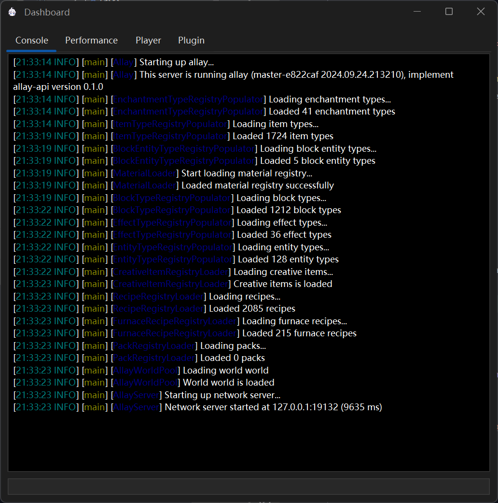

# Getting Started

Starting an Allay server would be very easy! The following guide will help you to 
install and run your first Allay server.

## Install Java 21

Allay is written and running in java 21, so you need to install java 21.
There are several version of java, and we recommend you to use [GraalVM](https://www.graalvm.org/) for the best performance,
and [OpenJDK](https://adoptopenjdk.net/) is also a good choice if you want to have a stable experience.

!!! tip

    If you are going to use GraalVM, please install the lastest LTS version instead of java 21 version.

After you have installed java 21, you can check if it is installed correctly by running the following command:

```shell
java --version
```

And if you have your java 21 installed correctly, the java version will be shown with no error message.

## Download Allay

Allay is currently in the development stage, so no release have been published yet.
You can download the latest version of Allay from [GitHub Action](https://github.com/AllayMC/Allay/actions?query=branch%3Amaster).

## Run Allay

You should now have a file named `allay-server-<yyyy.MM.dd.HHmmss>-<githash>-shaded.jar`, and an example name is `allay-server-2024.09.21.205626-9315b80ca-shaded.jar`.
If your platform has a graphical interface, you can just double-click the jar file to run it, then a window will pop up if you have installed java correctly:



If you are running on a server which does not have graphical interface, you can run the following command to start the server:

```shell
java -jar allay-server-<yyyy.MM.dd.HHmmss>-<githash>-shaded.jar
```

And the same output will be shown in the console.
