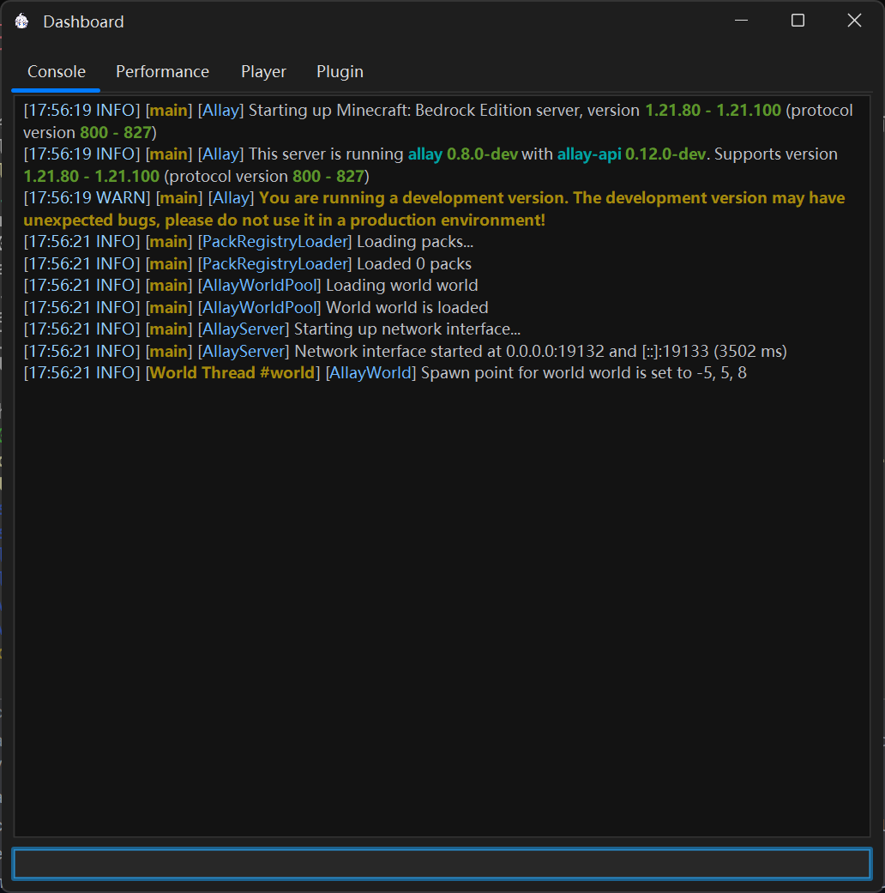

# Getting Started

Getting an **Allay** server up and running is simple!
This guide will walk you through installing and launching your first Allay server.

## Install Java

Allay requires **Java 21** to run. There are several Java distributions available, but we recommend the following:

- [**GraalVM**](https://www.graalvm.org/) – for best performance.
- [**OpenJDK**](https://adoptium.net/) – for a more stable and familiar experience.

!!! tip

    If you choose GraalVM, we recommend installing the latest **LTS** version (e.g. 22.3 LTS) rather than specifically Java 21.

Once installed, verify that Java is correctly set up by running:

```shell
java --version
```

If everything is installed correctly, you should see the version output with no error messages.

## Use AllayLauncher <small>(Recommended)</small>

[AllayLauncher](https://github.com/AllayMC/AllayLauncher) is a lightweight, fast tool (written in C++) that helps you
download, update, and manage your Allay server effortlessly.

To install it, you just need to run one command:

=== ":fontawesome-brands-windows: Windows"

    ```powershell
    Invoke-Expression (Invoke-WebRequest -Uri "https://raw.githubusercontent.com/AllayMC/AllayLauncher/refs/heads/main/scripts/install_windows.ps1").Content
    ```

=== ":fontawesome-brands-linux: Linux"

    ```bash
    wget -qO- https://raw.githubusercontent.com/AllayMC/AllayLauncher/refs/heads/main/scripts/install_linux.sh | bash
    ```

## Install Allay Manually

### Download Allay

Get the latest release from the [**GitHub Releases**](https://github.com/AllayMC/Allay/releases/latest) page.

For the bleeding-edge version with the latest features, you can also try the
[**Nightly Build**](https://github.com/AllayMC/Allay/releases/tag/nightly), which is built from the `master` branch.

### Run Allay

You should now have a file named like:

```
allay-server-<version>-<commit-hash>[-dev]-shaded.jar
```

Example:

```
allay-server-0.1.0-dev-shaded.jar
```

> The `-dev` suffix indicates a development version.

#### Running the Server

If your system has a graphical interface (GUI), just **double-click** the `.jar` file.
If Java is installed correctly, a window like this will appear:



If you're on a headless server (no GUI), start the server with:

```bash
java -jar allay-server-*-shaded.jar
```

You’ll see the same startup output in the terminal.