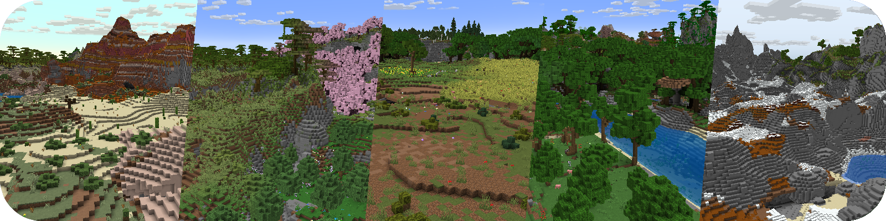

# Use Terra

Have you been tired of the boring ultra-flat terrain? Everyone playing on BDS server instead of your server? Well, struggle no more.

Introducing [Terra](https://github.com/PolyhedralDev/Terra), the best solution to solidify your position in the MCBE server space.



!!! about

    Terra is a modern world generation modding platform, primarily for Minecraft. Terra allows complete customization of world generation
    with an advanced API, tightly integrated with a powerful configuration system.

    Terra consists of several parts:

    - A voxel world generation API with emphasis on configuration and extensibility
    - Several platform implementations, the layer between the API and the platform it's running on
    - An addon loader, which allows addons to interface with the Terra API in a platform-agnostic setting
    - Several "core addons," which implement the "default" configurations of Terra. These addons can be thought of as the config "standard library"

## Install Terra

To install Terra in Allay, reach their CI site in [CodeMC](https://ci.codemc.io/job/PolyhedralDev/job/Terra/), and you will
see the latest build. Download the artifact named `Terra-allay-<version>-shaded.jar` and move it to the plugin folder.

## Edit World Settings

Next, we need to specify the terrain generator for the world as Terra instead of the built-in flat generator. For example,
if we want to modify the generator of default world, just open `worlds/orld-settings.yml` and modify the following:

```yml linenums="1" hl_lines="6-7"
worlds:
  world:
    storage-type: LEVELDB
    overworld:
      generator-type: TERRA
      generator-preset: pack=overworld;seed=114514
    nether: null
    the-end: null
default-world: world
```

To set the pack used in Terra and seed, edit `generator-preset` and fill in the format in the example. Please note that `overworld`
is Terra's default configuration package, which will be automatically downloaded when the plugin starts.

You may need to delete the old world files if the world is already generated. In this example, you should delete `worlds/world/db`.

**:partying_face: And that's it!** Restart the server and enjoy it!