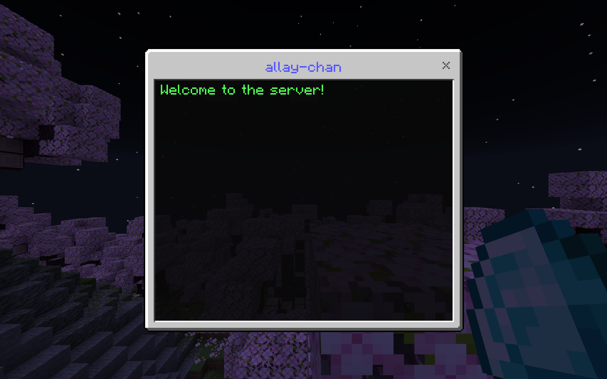
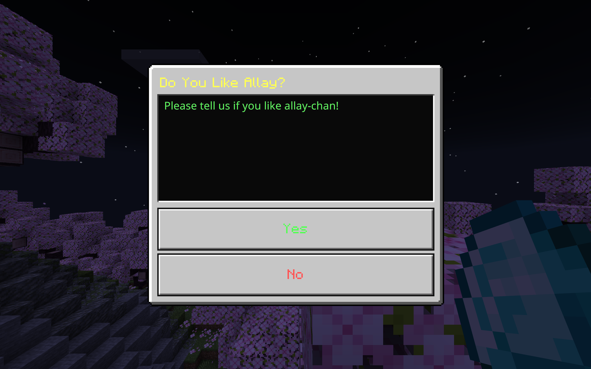

# Use Forms

Form is a special feature that exists in Minecraft: Bedrock Edition, which allows player to read and input data in a user-friendly way.
Allay provides a powerful form API that allows plugins to create and handle forms easily.

## Create and Send a Form

Let's say you want to show a simple form to the player when they join the server.
About how to register event listeners, please refer to [register an event listener](register-event-listeners.md).

```java linenums="1" hl_lines="8-11"
import org.allaymc.api.eventbus.event.player.PlayerJoinEvent;
import org.allaymc.api.form.Forms;
import org.allaymc.api.utils.TextFormat;

public class MyEventListener {
    @EventHandler
    private void onPlayerJoin(PlayerJoinEvent event) {
        Forms.simple()
                .title(TextFormat.BLUE + "allay-chan")
                .content(TextFormat.GREEN + "Welcome to the server!")
                .sendTo(event.getPlayer());
    }
}
```

**:partying_face: And that's it!**. [Build and install your plugin](create-your-first-plugin.md#build-and-install-your-plugin),
and when players join the server, they will see a form with the content `Welcome to the server!`:



## Handle Form Response

Let's get deeper. You may want to ask a player if they like your server
and reply with different content based on the player's options. Here's how you can do it:

```java linenums="1" hl_lines="12-14"
import org.allaymc.api.eventbus.EventHandler;
import org.allaymc.api.eventbus.event.player.PlayerJoinEvent;
import org.allaymc.api.form.Forms;
import org.allaymc.api.utils.TextFormat;

public class MyEventListener {
    @EventHandler
    private void onPlayerJoin(PlayerJoinEvent event) {
        var player = event.getPlayer();
        Forms.modal() /*(1)!*/
                .title(TextFormat.YELLOW + "Do You Like Allay?")
                .content(TextFormat.GREEN + "Please tell us if you like allay-chan!")
                .trueButton(TextFormat.GREEN + "Yes", () -> player.sendText("Thank you!"))
                .falseButton(TextFormat.RED + "No", () -> player.sendText("Sorry to hear that!"))
                .sendTo(player);
    }
}
```

1. :star: Modal form is a form type that only has two buttons.

And when players join the server, they will see a form with the title `Do You Like Allay?`
and two buttons `Yes` and `No`. When the player clicks on the `Yes` button, they will receive
a message `Thank you!`, and when they click on the `No` button, they will receive a message
`Sorry to hear that!`:



## Use Custom Form

Custom forms are the most powerful form type, allowing you to collect various types of data from players.
They support multiple element types and are perfect for settings pages, registration forms, or any scenario where you need structured input.

### Basic Custom Form Example

Let's create a simple feedback form that asks players for their name and comments:

```java linenums="1"
import org.allaymc.api.form.Forms;
import org.allaymc.api.utils.TextFormat;

public void showFeedbackForm(EntityPlayer player) {
    Forms.custom()
            .title(TextFormat.GOLD + "Player Feedback")
            .input("Your Name", "Enter your name...")
            .input("Comments", "Tell us what you think...", "")
            .onResponse(responses -> {
                String name = responses.get(0);
                String comments = responses.get(1);
                player.sendText("Thank you " + name + " for your feedback!");
            })
            .sendTo(player);
}
```

### Available Custom Form Elements

Custom forms support various element types to collect different kinds of data:

#### Input

Text input field for collecting string data:

```java linenums="1"
.input("Username", "Enter your username...")
.input("Email", "example@email.com", "default@example.com")
```

#### Dropdown

Dropdown menu for selecting one option from a list:

```java linenums="1"
.dropdown("Select Your Rank", "Bronze", "Silver", "Gold", "Diamond")
.dropdown("Choose Color", List.of("Red", "Blue", "Green"), 0)
```

#### Toggle

Boolean switch (on/off):

```java linenums="1"
.toggle("Enable Notifications")
.toggle("Auto-save", true) // default value is true
```

#### Slider

Numeric slider for selecting a value within a range:

```java linenums="1"
.slider("Volume", 0, 100) // min: 0, max: 100, step: 1
.slider("Difficulty", 1.0f, 10.0f, 1, 5.0f) // with default value
```

#### Step Slider

Slider that snaps to predefined text values:

```java linenums="1"
.stepSlider("Game Mode", "Easy", "Normal", "Hard", "Extreme")
.stepSlider("Quality", List.of("Low", "Medium", "High"), 1)
```

#### Label

Read-only text label (doesn't collect data):

```java linenums="1"
.label("This is an informational message.")
```

#### Header

Section header for organizing form elements:

```java linenums="1"
.header("Personal Information")
```

#### Divider

Visual separator between form sections:

```java linenums="1"
.divider()
```

### Complete Example: Player Registration Form

Here's a comprehensive example using multiple element types:

```java linenums="1"
import org.allaymc.api.form.Forms;
import org.allaymc.api.utils.TextFormat;
import java.util.List;

public void showRegistrationForm(EntityPlayer player) {
    Forms.custom()
            .title(TextFormat.AQUA + "Player Registration")
            .header("Basic Information")
            .input("Username", "Enter your username...", player.getOriginName())
            .input("Email", "example@email.com")
            .divider()
            .header("Game Preferences")
            .dropdown("Preferred Game Mode", "Survival", "Creative", "Adventure")
            .stepSlider("Difficulty", "Peaceful", "Easy", "Normal", "Hard")
            .slider("Render Distance", 2, 32, 2, 12)
            .divider()
            .header("Settings")
            .toggle("Receive Notifications", true)
            .toggle("Enable PvP", false)
            .label(TextFormat.GRAY + "Click Submit to complete registration")
            .onResponse(responses -> {
                // Elements are returned in the order they were added
                String username = responses.get(0);    // Input
                String email = responses.get(1);       // Input
                int gameModeIndex = Integer.parseInt(responses.get(2));  // Dropdown (index)
                int difficultyIndex = Integer.parseInt(responses.get(3)); // StepSlider (index)
                float renderDistance = Float.parseFloat(responses.get(4)); // Slider
                boolean notifications = Boolean.parseBoolean(responses.get(5)); // Toggle
                boolean pvp = Boolean.parseBoolean(responses.get(6)); // Toggle

                player.sendText(TextFormat.GREEN + "Registration complete!");
                player.sendText("Username: " + username);
                player.sendText("Email: " + email);
                player.sendText("Render Distance: " + renderDistance);
            })
            .onClose(reason -> {
                player.sendText(TextFormat.RED + "Registration cancelled");
            })
            .sendTo(player);
}
```

### Handling Custom Form Response

Custom form responses are returned as a `List<String>` in the order elements were added to the form.
You need to parse the values based on the element type:

| Element Type | Response Format  | How to Parse                                 |
|--------------|------------------|----------------------------------------------|
| Input        | String           | Direct use: `responses.get(index)`           |
| Dropdown     | String (index)   | `Integer.parseInt(responses.get(index))`     |
| Toggle       | String (boolean) | `Boolean.parseBoolean(responses.get(index))` |
| Slider       | String (float)   | `Float.parseFloat(responses.get(index))`     |
| Step Slider  | String (index)   | `Integer.parseInt(responses.get(index))`     |
| Label        | null             | Not included in responses                    |
| Header       | null             | Not included in responses                    |
| Divider      | null             | Not included in responses                    |

!!! warning "Important: Response Order"
    Elements like Label, Header, and Divider do NOT produce responses, but they still affect the indices.
    Always track the order of elements that produce responses (Input, Dropdown, Toggle, Slider, StepSlider).

### Tips for Using Custom Form

1. **Use Headers and Dividers**: Organize complex forms into sections for better readability
2. **Provide Placeholders**: Use meaningful placeholder text in input fields to guide users
3. **Set Default Values**: Pre-fill forms with sensible defaults when possible
4. **Validate Input**: Always validate and sanitize user input in your `onResponse` handler
5. **Handle Cancellation**: Implement `onClose()` to handle when players close the form without submitting

## Conclusion

**:partying_face: Let's make a conclusion!** Here are all available form types that you can use in minecraft:

| Type   | Description                                                                                                                                                                                     |
|--------|-------------------------------------------------------------------------------------------------------------------------------------------------------------------------------------------------|
| Simple | Simple form can use buttons, and server will receive response when the player presses a button. It is very useful if you want to serve player a set of options and let him choose one.          |
| Modal  | Modal form is a small form that has two buttons. It is suitable for letting player to confirm something.                                                                                        |
| Custom | Custom form is a form that can use a lot of different elements such as dropdown, slider, toggle and has a submit button at the bottom. It can be used when you want player to submit some data. |
